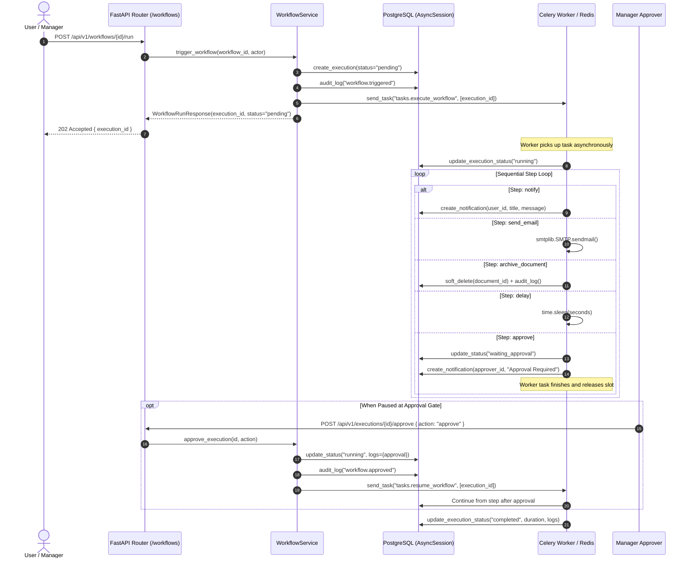

# Phase 8 — Workflow Engine & Multi-Step Automation Documentation

## Overview

Milestone 8 introduces the **IntelliFlow AI Workflow Engine** — an enterprise asynchronous task orchestration system that enables users to define, execute, and monitor multi-step automated process pipelines.

**Definition of Done:** *"Workflow executes automatically."*

---

## Key Capabilities

1. **Multi-Step Pipelines**: Define sequences of ordered, atomic actions that execute asynchronously without blocking API threads.
2. **Supported Step Actions**:
   - `notify`: Generates in-app notifications with target user routing and priority levels.
   - `send_email`: Dispatches emails via configurable SMTP settings (`SMTP_HOST`, `SMTP_PORT`, `SMTP_USER`, `SMTP_PASSWORD`, `SMTP_FROM`, `SMTP_USE_TLS`).
   - `archive_document`: Soft-deletes document records with full RBAC validation (owner or admin/hr) and audit logging.
   - `approve`: Pauses pipeline execution, notifies approvers, sets `waiting_approval` state, and awaits interactive management resolution without holding worker resources.
   - `delay`: Non-blocking synchronous timer pause (1–300s) inside Celery.
3. **Execution State Machine**:
   - `pending` → `running` → `completed` | `failed` | `waiting_approval` → `running` → `completed` | `rejected`
4. **Audit Trail**: Every workflow creation, update, deletion, execution trigger, and approval action is persisted in `audit_logs` with actor UUID, timestamp, and IP address.
5. **Real-Time UI**: Live status badges, execution history timeline, step-by-step logs viewer, interactive approval card, and step sequence builder.

---

## API Specification

### Workflow CRUD & Execution Endpoints

| Method | Path | Summary | RBAC |
|---|---|---|---|
| `POST` | `/api/v1/workflows` | Create a new workflow definition with ordered steps | Manager, Admin |
| `GET` | `/api/v1/workflows` | List workflows (paginated, with search & filtering) | Authenticated |
| `GET` | `/api/v1/workflows/{id}` | Get workflow details with eager-loaded steps | Authenticated |
| `PUT` | `/api/v1/workflows/{id}` | Update workflow metadata or replace step sequence | Manager, Admin |
| `DELETE` | `/api/v1/workflows/{id}` | Soft-delete a workflow (preserves executions) | Admin |
| `POST` | `/api/v1/workflows/{id}/run` | Asynchronously trigger workflow execution | Manager, Admin |
| `GET` | `/api/v1/workflows/{id}/executions` | Get execution history for a workflow | Authenticated |
| `GET` | `/api/v1/executions/{id}` | Get status and logs of a specific execution | Authenticated |
| `POST` | `/api/v1/executions/{id}/approve` | Approve or reject a workflow paused at an approval gate | Manager, Admin |

---

## Architecture & Data Flow



---

## Configuration Settings

Settings in `backend/app/core/config.py`:

```python
# SMTP Settings
SMTP_HOST: str = ""
SMTP_PORT: int = 587
SMTP_USER: str = ""
SMTP_PASSWORD: str = ""
SMTP_FROM: str = "noreply@intelliflow.ai"
SMTP_USE_TLS: bool = True

# Workflow Engine Limits
WORKFLOW_MAX_STEPS: int = 20
WORKFLOW_MAX_DELAY_SECONDS: int = 300
WORKFLOW_APPROVE_TIMEOUT_SECONDS: int = 86400  # 24 hours
```

---

## Verification & Testing

### Automated Test Suites
- `backend/tests/test_workflows.py`: 25 integration tests covering CRUD, RBAC, execution triggering, approval validation, error handling, and dashboard integration.
- `backend/tests/test_workflow_tasks.py`: 10 worker task tests covering all 5 step handlers, retry mechanisms, pause-and-resume semantics, and failure recovery.

Run tests:
```bash
cd backend
pytest tests/test_workflows.py tests/test_workflow_tasks.py -v
```
