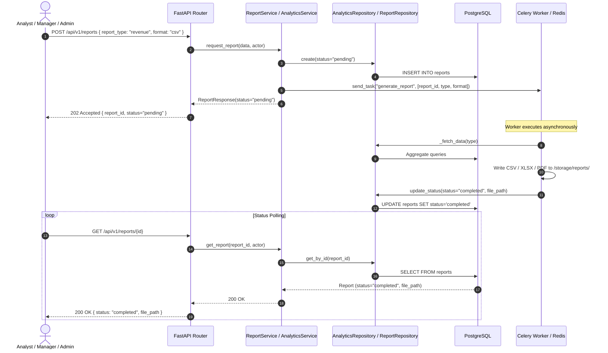

# Phase 9 — Analytics, AI Predictions & Exportable Reports Documentation

## Overview

Milestone 9 introduces the **IntelliFlow AI Analytics & Prediction Suite** — comprehensive operational business intelligence dashboards, statistical forecasting engines, and asynchronous multi-format report compilation with CSV, Excel, and PDF export capabilities.

**Definition of Done:** *"Analytics and prediction charts render with accurate data, and reports compile asynchronously across CSV, XLSX, and PDF formats."*

---

## Key Capabilities

1. **7-Dimensional Operational Analytics**:
   - **KPI Overview**: Aggregated headcounts, document vault totals, active workflows, completed executions, AI conversations, prediction runs, and compiled reports.
   - **Financial & Revenue**: 12-month payroll-derived expense baselines, estimated revenues, and quarterly profit trajectories.
   - **Departmental**: Per-unit headcount, average salary, document ownership count, and workflow automation metrics.
   - **Workforce & Headcount**: Total/active/new-this-month headcounts, role distribution, and monthly joiner trends.
   - **Document Vault & OCR**: Upload volume trends, document processing status distributions, and OCR pipeline completion breakdowns.
   - **Workflow Automation**: Total execution metrics, status distributions, runtime duration averages, and step-action frequency analysis.
   - **AI Assistant Consumption**: Conversation volume trends, prompt/completion token consumption metrics, and response latencies.

2. **Deterministic AI Predictive Models**:
   - `revenue_forecast`: 12-month revenue, expense, and profit trajectories projected from payroll data.
   - `employee_attrition`: Departmental attrition risk probabilities based on headcount dynamics and team composition.
   - `customer_churn`: Churn likelihood derived from AI conversation engagement and document access patterns.

3. **Asynchronous Report Generation (Celery)**:
   - Request generation of any dataset category (`revenue`, `employees`, `departments`, `workflows`, `documents`, `ai_usage`).
   - Choose output format: `csv`, `xlsx` (Excel), or `pdf`.
   - Non-blocking task dispatch with status polling (`pending` → `completed` | `failed`).
   - Role-based visibility: employees access their own exports; admin, HR, manager, and finance roles access all organizational reports.

---

## API Specification

### Analytics Endpoints

| Method | Path | Summary | RBAC |
|---|---|---|---|
| `GET` | `/api/v1/analytics/kpi` | Aggregated top-level KPI metrics | Admin, Manager, HR, Finance |
| `GET` | `/api/v1/analytics/revenue` | 12-month revenue & expense projection (query param `year`) | Admin, Manager, HR, Finance |
| `GET` | `/api/v1/analytics/departments` | Per-department analytics breakdown | Admin, Manager, HR, Finance |
| `GET` | `/api/v1/analytics/employees` | Workforce composition & headcount trends | Admin, Manager, HR, Finance |
| `GET` | `/api/v1/analytics/documents` | Document upload trends & OCR status distributions | Admin, Manager, HR, Finance |
| `GET` | `/api/v1/analytics/workflows` | Workflow execution stats & step frequency | Admin, Manager, HR, Finance |
| `GET` | `/api/v1/analytics/ai` | AI conversation consumption & token metrics | Admin, Manager, HR, Finance |

### Prediction Endpoints

| Method | Path | Summary | RBAC |
|---|---|---|---|
| `POST` | `/api/v1/predictions` | Run a forecast model (`revenue_forecast`, `employee_attrition`, `customer_churn`) | Admin, Manager, Finance, HR |
| `GET` | `/api/v1/predictions` | List paginated prediction execution history | Admin, Manager, Finance, HR |
| `GET` | `/api/v1/predictions/{id}` | Get details and output of a specific prediction | Admin, Manager, Finance, HR |

### Report Endpoints

| Method | Path | Summary | RBAC |
|---|---|---|---|
| `POST` | `/api/v1/reports` | Enqueue async report compilation | All Authenticated Users |
| `GET` | `/api/v1/reports` | List reports (own or all depending on role) | All Authenticated Users |
| `GET` | `/api/v1/reports/{id}` | Get status and file path of a report | All Authenticated Users |

---

## Architecture & Data Flow

---

## Verification & Test Coverage

- **66 Unit & Integration Tests** covering all Analytics, Prediction, and Report endpoints.
- **RBAC Authentication & Authorization**: Verified across all 5 standard roles (`admin`, `manager`, `hr`, `finance`, `employee`).
- **Data Integrity & Fallback**: Validated against in-memory SQLite and PostgreSQL production schemas.
